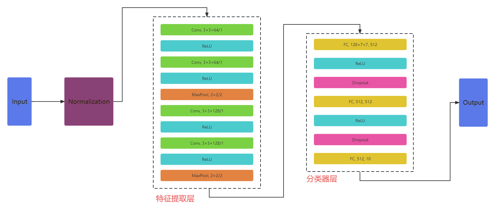
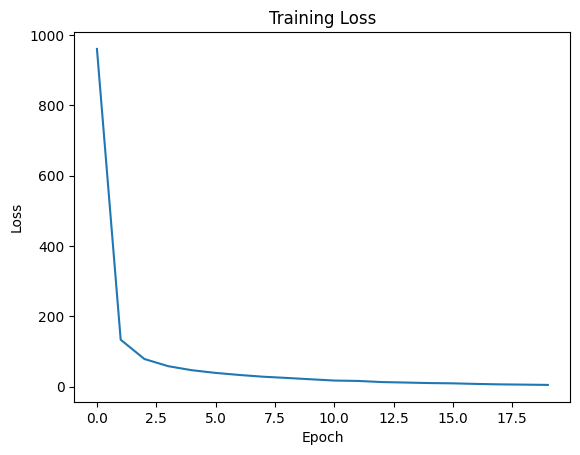
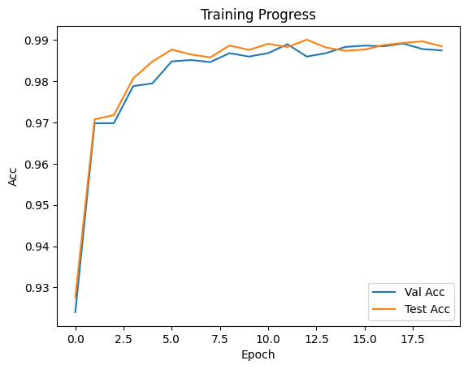
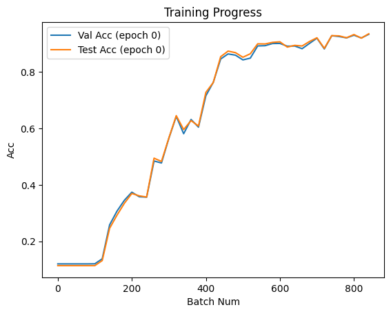

# 编程任务报告

## 一、模型结构

### （一）结构说明
本次大作业需要完成的是图片分类任务。本人构建了一个卷积神经网络模型 `MyCNN` 来进行分类。该模型的结构如下：
- 特征提取层
    - 【第一层】卷积层，输入通道数为1，输出通道数为64，卷积核大小为3，步幅为默认值1，填充大小为1，使用 `ReLU` 激活函数。
    - 【第二层】卷积层，输入通道数为64，输出通道数为64，卷积核大小为3，步幅为默认值1，填充大小为1，使用 `ReLU` 激活函数。
    - 【第三层】最大池化层，池化核大小为2，步幅为2。
    - 【第四层】卷积层，输入通道数为64，输出通道数为128，卷积核大小为3，步幅为默认值1，填充大小为1，使用 `ReLU` 激活函数。
    - 【第五层】卷积层，输入通道数为128，输出通道数为128，卷积核大小为3，步幅为默认值1，填充大小为1，使用 `ReLU` 激活函数。
    - 【第六层】最大池化层，池化核大小为2，步幅为2。
- 分类器层
    - 【第一层】全连接层，输入大小为128 * 7 * 7，输出大小为512，使用 `ReLU` 激活函数。
    - 【第二层】采用 `Dropout` 操作以减少过拟合。
    - 【第三层】全连接层，输入大小为512，输出大小为512，使用 `ReLU` 激活函数。
    - 【第四层】采用 `Dropout` 操作以减少过拟合。
    - 【第五层】全连接层，输入大小为512，输出大小为10，用于生成最终分类结果。

结构图如下所示：


### （二）设计分析

该卷积神经网络由卷积层、`ReLU` 层、最大池化层、全连接层、`Dropout`层等部分组合而成。

- 卷积层：在特征提取过程中起到关键作用。它通过应用一组可学习的滤波器（卷积核）对输入数据进行卷积操作，从而提取出输入数据的局部特征和抽象表示。卷积层的主要功能是通过滑动窗口的方式对输入数据进行扫描，计算每个滑动窗口下的卷积操作，捕捉输入数据的结构、纹理、边缘等重要信息，生成特征图作为下一层的输入，同时在整个输入数据上共享权重，有效减少参数数量。
- `ReLU` 层：是一种常用的激活函数层。它的功能是引入非线性变换，将负值置为零，保留正值。通过应用 ReLU 激活函数，网络能够增强非线性表示能力，提升模型的表达能力，从而得以学习更复杂的特征表示。ReLU 层在特征提取过程中有助于激活感兴趣的特征并抑制无用的信息。
- 最大池化层：对特征图进行下采样，减小特征图的空间维度，保留关键信息。通过在局部区域选择最大值，最大池化层能够保留主要的特征信息并丢弃不相关的细节。这有助于降低模型复杂度、减少参数数量，提取更显著的特征，并且具备平移不变性的特性，增强模型的鲁棒性。
- 全连接层：将特征表示映射到类别标签或概率分布。通过矩阵乘法和偏置项实现线性变换，并通过激活函数引入非线性，增加网络的表达能力。全连接层的主要功能是将高级的特征表示与类别之间建立联系，生成与类别相关的预测结果。它能够捕捉到特征之间的复杂关系，并学习到不同类别之间的决策边界。
- `Dropout` 层：是一种正则化技术，用于减少模型的过拟合风险。Dropout 层的功能是以一定概率随机丢弃一些神经元输出，即将它们的值置为零。这样可以强制网络学习到冗余特征的多样性，阻止网络过于依赖某些特征，增加模型的泛化能力，并减少神经元之间的依赖关系。Dropout 层在训练过程中有助于提高模型的鲁棒性和泛化能力。

根据所承担的不同功能，可以将这个卷积神经网络划分成**特征提取网络**、**分类器网络**两大模块。

- 特征提取网络：由一系列卷积层、激活层和池化层组成，主要负责对经过预处理后的输入图片进行特征提取，将输入数据转化为更高层次、更抽象的特征表示。通过多次堆叠卷积层、激活层和池化层，特征提取层能够逐渐提取出数据中的局部特征、全局特征和语义信息，获得不同层次的特征。这些特征可以更好地表示输入数据的结构和模式，为后续的分类任务提供更具区分性和可学习性的信息。

- 分类器网络：用于将从特征提取层获得的高级特征映射转化为最终的类别预测结果。分类器网络包含了多个线性层和非线性激活层，通过这些层的组合，网络能够学习到输入图像在不同类别上的表示和区分性特征，从而进行分类任务。

### （三）代码实现

```Python
class MyCNN(nn.Module):
    def __init__(self, *args, **kwargs) -> None:
        super().__init__(*args, **kwargs)
        # 特征提取层
        self.features = nn.Sequential(
            nn.Conv2d(1, 64, kernel_size=3, padding=1),
            nn.ReLU(inplace=True),
            nn.Conv2d(64, 64, kernel_size=3, padding=1),
            nn.ReLU(inplace=True),
            nn.MaxPool2d(kernel_size=2, stride=2),
            nn.Conv2d(64, 128, kernel_size=3, padding=1),
            nn.ReLU(inplace=True),
            nn.Conv2d(128, 128, kernel_size=3, padding=1),
            nn.ReLU(inplace=True),
            nn.MaxPool2d(kernel_size=2, stride=2),
        )
        # 分类器层
        self.classifier = nn.Sequential(
            nn.Linear(128 * 7 * 7, 512),
            nn.ReLU(inplace=True),
            nn.Dropout(),
            nn.Linear(512, 512),
            nn.ReLU(inplace=True),
            nn.Dropout(),
            nn.Linear(512, 10)
        )

    def forward(self, x):
        x = self.features(x) # 特征提取层的前向传播
        x = x.view(x.size(0), -1) # 将输入张量x进行形状变换，将其从多维的特征图展平为一维向量，以便输入到全连接层进行分类任务
        x = self.classifier(x) # 分类器层的前向传播
        return x
```

## 二、超参数选择

| 参数名型              | 参数值 | 说明                                                         |
| --------------------- | ------ | ------------------------------------------------------------ |
| 随机种子SEED          | 2023   | 设置为任意一个合法定值即可，作用是便于复现运行结果。         |
| 批处理大小BATCH_SIZE  | 64     | 稍高一些的批处理大小有利于减少内存访问次数，并且能提供更稳定的梯度估计（包含更多的样本信息，有助于减少梯度的方差），从而在训练过程中获得更加平滑和稳定的参数更新。 |
| 迭代训练次数EPOCH_NUM | 20     | 选择合适的迭代训练次数，既能让模型有更多的机会逐渐优化和调整参数、学习更多的特征和模式，同时也避免出现过拟合问题。 |
| 学习率lr              | 0.01   | 选择合适的学习率，既可以加快模型的收敛速度，帮助模型跳出局部最优解、探索更广阔的参数空间，同时也能够避免训练不稳定甚至发散的问题。 |
| 卷积核大小            | 3×3    | 较小的卷积核可以捕捉输入图像中的局部特征。对于图像处理任务，局部特征通常包含有用的信息，例如边缘、纹理等。使用3x3的卷积核可以在不丢失太多细节的情况下，有效地提取这些局部特征。同时，较小的卷积核可以在多个位置共享权重，使得模型更加紧凑而且更容易训练。 |
| 卷积核步幅、填充            | 均为1      | 步幅为1意味着卷积核每次移动一个像素，这样可以保留输入图像的空间信息。通过保持相对较小的步幅，模型可以更好地捕捉输入数据中的细节和空间关系，有助于提高模型的感知能力。此外，步幅为1、大小为3×3、填充为1时，卷积操作生成的特征图的尺寸与输入图像的尺寸保持一致，这有助于减少信息损失，确保在特征提取过程中不会丢失重要的细节。 |
| 池化层大小            | 2×2    | 池化层大小设定为2×2，可以减小特征图的空间维度，选择局部区域中的最显著特征值作为池化结果，将特征图的尺寸缩小一半。这样可以降低空间维度，并减少后续层的计算量和参数数量，从而提高模型的计算效率。 |
| 池化层步幅            | 2      | 池化层步幅为2，意味着池化窗口每次移动2个像素，相应输出的特征图的尺寸将会是输入的一半。这有助于减少信息损失，保留重要的特征，同时降低了模型的计算负担。 |

## 三、数据预处理

### （一）预处理流程
- 首先定义了一个 `transform` 对象，它是由两个 `transforms` 组成的列表构成。第一个 `transforms.ToTensor()` 将 `PIL` 图像转换为 `Tensor` 对象，将像素值从$[0, 255]$归一化到$[0, 1]$的范围内。第二个 `transforms.Normalize((0.1307,), (0.3081,))` 对图像进行标准化，使用的均值为$0.1307$，标准差为$0.3081$。这么做是因为，对于MNIST数据集，经过统计分析可以得到像素值的平均值约为$0.1307$，标准差约为$0.3081$。因此，使用上述平均值、标准差进行标准化可以使预处理后的数据更接近标准正态分布。

- 接下来，加载训练集数据并划分出验证集。`MNIST` 是一个 `PyTorch` 内置的数据集类，用于加载MNIST手写数字数据集。`root='./data'` 指定了数据集存放的路径。`train=True` 表示加载训练集，`download=True` 表示如果数据集不存在，则自动下载。`transform=transform` 表示对加载的图像应用之前定义的 `transform` 进行预处理。`random_split` 函数用于将训练集划分为训练集和验证集，其中验证集的大小为原本训练集大小的$10\%$。`torch.Generator().manual_seed(SEED)` 设置了随机种子，保证每次划分结果一致。最后，使用 `DataLoader` 将训练集和验证集封装成可迭代的数据加载器，`batch_size` 指定了每个批次的样本数量，`shuffle=True` 表示每个epoch重新洗牌数据，`num_workers=0` 表示使用单个进程加载数据。

- 然后，加载测试集数据。加载过程与加载训练集的过程类似，只不过需要改为设置 `train=False` 表示加载测试集。

- 最后，打印输出训练集、验证集和测试集的大小，即样本数量。

### （二）代码实现

```python
# 先将 PIL 图像的像素值由 [0, 255] 归一化为 [0,1]
# 再进行均值为 0.1307 、标准差为 0.3081 的标准化
transform = transforms.Compose(
    [transforms.ToTensor(),
     transforms.Normalize((0.1307,), (0.3081,))]
)

# 加载训练集数据，并划分出验证集
train_set = MNIST(root='./data', train=True, download=True, transform=transform)
val_size = int(0.1 * len(train_set)) # 选取其中的 1/10 作为验证集
train_set, val_set = random_split(train_set, [len(train_set) - val_size, val_size], generator=torch.Generator().manual_seed(SEED))
train_loader = DataLoader(train_set, batch_size=BATCH_SIZE, shuffle=True, num_workers=0)
val_loader = DataLoader(val_set, batch_size=BATCH_SIZE, shuffle=True, num_workers=0)

# 加载测试集数据
test_set = MNIST(root='./data', train=False, download=True, transform=transform)
test_loader = DataLoader(test_set, batch_size=BATCH_SIZE, shuffle=True, num_workers=0)
print(f"train_size = {len(train_set)}")
print(f"val_size = {len(val_set)}")
print(f"test_size = {len(test_set)}")
```

## 四、训练过程

### （一）训练流程
- 创建自定义CNN模型的实例 `net` 。
- 定义交叉熵损失函数 `criterion`。
- 定义随机梯度下降（SGD）优化器 `optimizer` ，将模型参数传递给优化器进行优化。
- 初始化一些列表用于记录每个epoch的损失值和准确率。
- 进行多个epoch的训练，每个epoch的循环完成如下操作：
    - 初始化每个epoch的损失值为0。
    - 遍历训练数据集，取出每个batch，完成如下操作：
        - 如果是第0个epoch且当前批次的索引是20的倍数，进行验证集和测试集的评估并记录结果（**主要目的是为了观察训练刚开始时准确率快速上升的过程，详见后面部分的性能分析**）。
        - 清零优化器的梯度。
        - 将输入数据 `imgs` 通过网络 `net` 进行前向传播得到输出 `ouputs` 。
        - 计算损失值 `loss` 。
        - 进行反向传播计算梯度 `loss.backward()` 。
        - 根据梯度更新模型参数 `optimizer.step()` 。
        - 累加损失值到当前epoch的损失值 `epoch_loss` 。
        - 重复上述过程，直到完成全部训练数据的一次遍历。
    - 将当前epoch的累加损失值添加到损失列表 `epoch_loss_list`。
    - 打印当前epoch的索引和累加损失值。
    - 在验证集上进行测试并将准确率记录到验证集准确率列表 `val_acc_list` 。
    - 在测试集上进行测试并将准确率记录到测试集准确率列表 `test_acc_list` 。
    - 本轮epoch的循环结束。

### （二）代码实现

```python
net = MyCNN() # 创建自定义CNN模型的实例
criterion = nn.CrossEntropyLoss() # 定义交叉熵损失函数
optimizer = optim.SGD(net.parameters(), lr=0.01) # 定义随机梯度下降（SGD）优化器，将模型参数传递给优化器进行优化

epoch_loss_list = [] # 记录每个epoch的损失值
val_acc_list = [] # 记录每个epoch在验证集上的准确率
test_acc_list = [] # 记录每个epoch在测试集上的准确率

epoch0_val_acc_list = [] # 记录第0个epoch在验证集上的准确率
epoch0_test_acc_list = [] # 记录第0个epoch在测试集上的准确率
batch_num_list = [] # 记录第0个epoch中被处理的批次数

for epoch in range(EPOCH_NUM): # 迭代训练多个epochs
    epoch_loss = 0 # 用于记录每个epoch的损失值
    for index, (imgs, labels) in enumerate(train_loader, 0): # 遍历训练数据集
        if epoch == 0 and index % 20 == 0:
            batch_num_list.append(index)
            eval_model(net=net, epoch=epoch, acc_list=epoch0_val_acc_list, is_validation=True, is_print=False) # 在验证集上进行测试
            eval_model(net=net, epoch=epoch, acc_list=epoch0_test_acc_list, is_validation=False, is_print=False) # 在测试集上进行测试
        optimizer.zero_grad() # 梯度清零，防止梯度累积
        ouputs = net(imgs) # 前向传播计算输出
        loss = criterion(ouputs, labels) # 计算损失值
        loss.backward() # 反向传播计算梯度
        optimizer.step() # 根据梯度更新模型参数
        epoch_loss += loss.item() # 累加损失值
    epoch_loss_list.append(epoch_loss)
    print(f"epoch {epoch} over, epoch_loss = {epoch_loss}") # 打印当前epoch的索引和损失值

    eval_model(net=net, epoch=epoch, acc_list=val_acc_list, is_validation=True, is_print=True) # 在验证集上进行测试

    eval_model(net=net, epoch=epoch, acc_list=test_acc_list, is_validation=False, is_print=True) # 在测试集上进行测试
```

## 五、性能分析

每一轮epoch**训练完成**后，计算出当前epoch的损失并记录下来，同时让模型分别在验证集、测试集上进行**推理**，获得相应的准确率，一并记录下来。得到的结果如下表所示：（**保留四位小数**）

| epoch | 训练损失 | 验证集准确率 | 训练集准确率 |
| ----- | -------- | ------------ | ------------ |
| 0     | 960.9552 | 0.9240       | 0.9276       |
| 1     | 133.4843 | 0.9698       | 0.9708       |
| 2     | 78.5701  | 0.9698       | 0.9718       |
| 3     | 58.1848  | 0.9788       | 0.9807       |
| 4     | 46.6167  | 0.9795       | 0.9848       |
| 5     | 38.9930  | 0.9848       | 0.9877       |
| 6     | 33.1311  | 0.9852       | 0.9865       |
| 7     | 28.1720  | 0.9847       | 0.9858       |
| 8     | 24.6681  | 0.9868       | 0.9887       |
| 9     | 20.9147  | 0.9860       | 0.9876       |
| 10    | 17.2445  | 0.9868       | 0.9891       |
| 11    | 16.1323  | 0.9890       | 0.9883       |
| 12    | 12.9319  | 0.9860       | 0.9901       |
| 13    | 11.5742  | 0.9868       | 0.9882       |
| 14    | 10.1049  | 0.9883       | 0.9874       |
| 15    | 9.2880   | 0.9887       | 0.9877       |
| 16    | 7.6334   | 0.9885       | 0.9888       |
| 17    | 6.3611   | 0.9892       | 0.9893       |
| 18    | 5.6519   | 0.9878       | 0.9897       |
| 19    | 4.8042   | 0.9875       | 0.9885       |

### （一）损失值关于epoch的变化曲线



使用分类任务常用的**交叉熵损失**作为损失函数。由上图不难看出，从第0个epoch到第19个epoch，损失值逐渐减小，由一开始的$1000$左右下降至低于$5$的水平。同时，模型刚开始的训练速度较快，仅用了2个epoch就将损失下降到了$100$以内，之后训练速度才放缓。这些都表明模型在前期迅速地学习到了训练数据中的模式和特征，并不断收敛，逐渐接近最优解，模型的优化过程是有效的。在训练的中后期，损失值的下降速度变缓，但仍然在持续地保持下降趋势，这说明模型已经非常接近其最佳性能。

### （二）准确率关于epoch的变化曲线



- 验证集准确率从初始的$0.9240$开始逐渐提高，最后稳定在$0.9875$左右，最高准确率能达到$0.9892$。这意味着模型在验证集上的分类性能随着训练的进行而逐渐改善。

- 测试集准确率也呈现出与验证集类似的趋势，从初始的$0.9276$逐渐提高到最后的$0.9885$左右，最高准确率能达到$0.9901$。这表明模型在未见过的数据上表现良好，并且随着训练的进行，其泛化能力得到了提升。

- 观察 `val_acc` 和 `test_acc` 的数值，可以看到它们的值基本保持一致，最终均能取得$99\%$左右的准确率。这表示模型在训练集上的性能能够良好地泛化到未见过的数据上。这是一个好的迹象，说明模型不会过度拟合训练数据。

### （三）第0个epoch的准确率关于batch数的变化曲线



一开始，模型的参数是随机初始化的，因此在没有经过训练的情况下，它对于分类任务的准确率非常低，只能取得大约$10\%$左右的准确率。这是因为模型还没有学习到有效的特征表示，无法正确地对样本进行分类。

然而，通过对训练过程的观察，我们可以看到模型的准确率在短时间内迅速获得了稳定的提升。仅经过大约$200$个batch的训练，准确率就提升至约$40\%$左右；经过约$400$个batch的训练，准确率又提升至约$60\%$左右。这显示出模型对于训练数据中的模式和特征有了初步的学习。

随着训练的继续，模型在第0个epoch即将结束时达到了约$92\%$左右的准确率水平。这是一个显著的提升，为后面多轮epoch的迭代调优、实现性能的进一步提升奠定良好基础，同时也表明模型已经学习到了有效的特征表示，并且能够在很大程度上正确地对样本进行分类。

这种迅速提升的过程说明了该卷积神经网络在训练过程中的优秀性能。通过对训练数据的迭代学习和参数调整，模型逐渐改善了自身的能力，更准确地捕捉到了数据的结构和规律。

## 六、遇到的挑战及解决办法

- 挑战1：模型结构设计问题。选择合适的模型结构对于分类任务的成功很重要。在刚开始进行设计的时候，对于神经网络模型的构建，我比较缺乏清晰的思路。
    - 解决办法：
        - 我参考经典的卷积神经网络 `VGG` 来设计自己的网络结构。与 `VGG` 的网络结构类似，我的模型在特征提取层使用了多个卷积层和池化层的堆叠，在卷积层后面都使用了 `ReLU` 激活函数，分类器层也是由几个全连接层组成的。不同之处在于，相对于经典的 `VGG` 模型，我的模型结构相对较浅，因而参数数量相对较少。
        - 总之，我的模型在结构上受到了 `VGG` 模型的启发，但相对而言仍是一个简化版本。它使用了类似的卷积层和池化层堆叠的结构，并采用了 `ReLU` 激活函数和全连接层分类器。然而，由于模型深度和宽度的不同，以及参数数量和卷积核的差异，它与经典的 `VGG` 模型仍然有一些明显不同。

- 挑战2：超参数选择问题。超参数是由人预先设置的，一旦确定下来，在模型的训练过程中不可再被调整。如果选择了不好的超参数，将极为影响模型的性能表现，而且这种不好的影响是难以通过后续训练来消除的。因此，如何找到较为合适的超参数也是设计的一大挑战。
    - 解决办法：
        - 受到经典的**k折交叉验证法**的启发，我使用**划分验证集的方式**来不断探索新的超参数空间，找到较为适合的超参数组合，避免对训练集的过度拟合。
        - 具体来说，我会在数据预处理阶段从训练集数据中划分出一部分数据，作为**验证集**。这部分验证集数据**不能用于反向传播时模型参数的更新**，只能用于在模型训练的过程中对模型进行性能测试，以此检验模型的鲁棒性、泛化性。通过设定多组超参数，并相应地比较它们在验证集的性能表现，我可以从中选择出相对较优的超参数组合。

- 挑战3：数据预处理问题。在进行模型训练之前，需要对原始数据进行预处理，如数据归一化、标准化等步骤。在刚开始处理MNIST数据集时，我较为缺乏明确的预处理思路。
    - 解决办法：
        - 通过调研分析，我了解到将像素值由$[0, 255]$**归一化**到$[0, 1]$范围并进行**标准化**是深度学习中常见的数据预处理步骤。这么做是因为：归一化可以确保输入数据的数值范围一致，避免了不同特征或输入之间的数值差异过大所引起的问题；还可以保证输入值的范围在激活函数的敏感区域内，避免激活函数在输入较大或较小的情况下表现不佳的情况；此外，还能减少模型复杂性，使不同特征具有相似的分布，减少模型中的不必要的自由度。
        - 此外，我还对原始数据进行探索和可视化分析，以更好地了解数据的特征和分布。我了解到MNIST数据集像素值的平均值约为$0.1307$，标准差约为$0.3081$。因此，我使用了均值为$0.1307$、标准差为$0.3081$的标准化。
